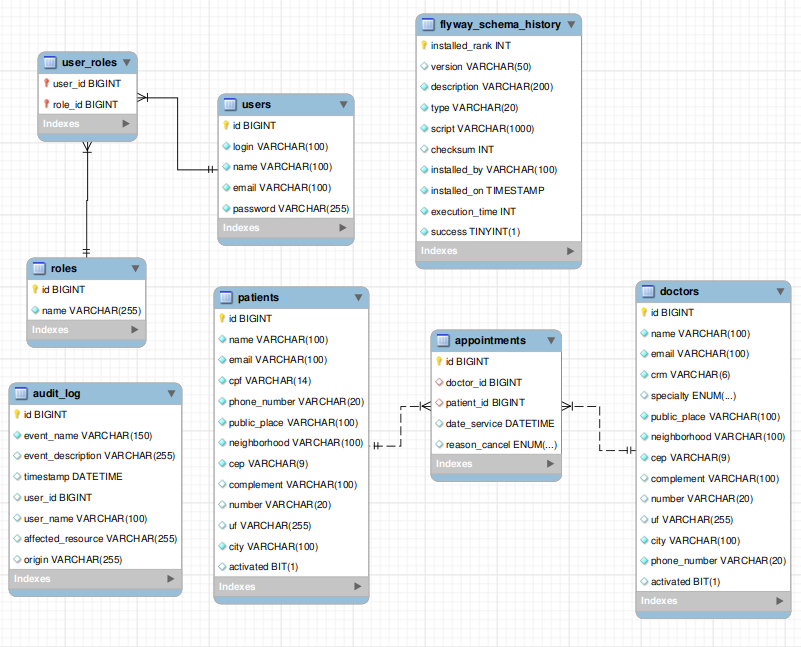
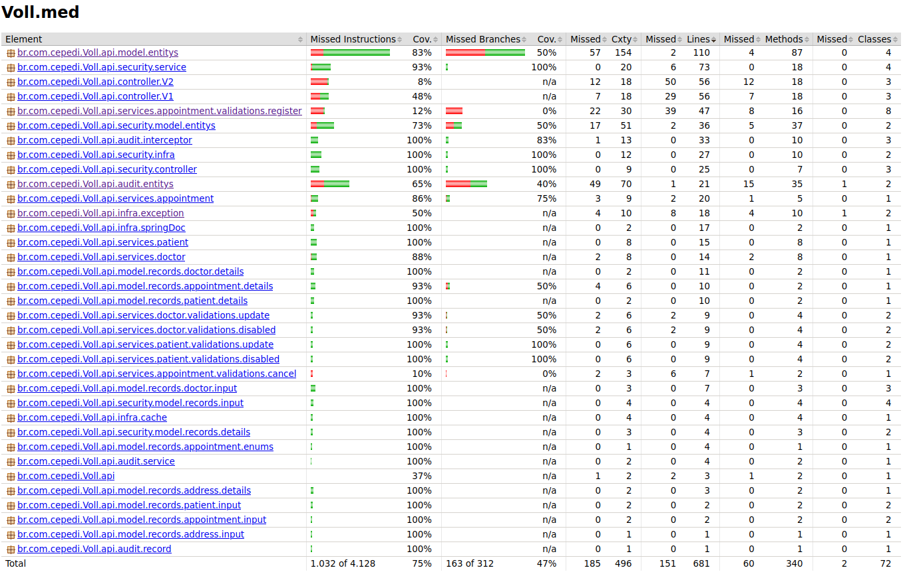

# API README

## Overview
This API serves as a backend system for managing appointments, doctors, and patients within a healthcare environment. It provides endpoints for scheduling appointments, registering doctors and patients, updating their information, and listing details.

## Image of the database generated in workbench

## Technologies Used
- Java
- Spring Boot
- MySQL
- Spring Security
- Swagger for API documentation

## Security
Spring Security has been implemented for token-based authentication, ensuring that only authorized users can access the endpoints. The API requires a bearer token for authentication.

Sensitive information such as database credentials and tokens are managed using environment variables to enhance security.

## Endpoints

### Appointment Controller (`/appointments`)
- `POST /appointments`: Schedule a new appointment.
- `DELETE /appointments`: Cancel an appointment.

### Doctor Controller (`/doctors`)
- `POST /doctors`: Register a new doctor.
- `GET /doctors`: Get a paginated list of doctors.
- `GET /doctors/{id}`: Get details of a specific doctor.
- `PUT /doctors`: Update doctor information.
- `DELETE /doctors/{id}`: Disable a doctor.

### Patient Controller (`/patients`)
- `POST /patients`: Register a new patient.
- `GET /patients`: Get a paginated list of patients.
- `GET /patients/{id}`: Get details of a specific patient.
- `PUT /patients`: Update patient information.
- `DELETE /patients/{id}`: Disable a patient.

## Logging
Logging is implemented using SLF4J, providing insights into the execution flow of the application. Logs include information such as scheduling appointments, registering doctors and patients, and updating their details.

## Data Validation
Data validation is performed using Jakarta Bean Validation (`@Valid`). This ensures that only valid data is accepted by the API, enhancing data integrity and security.

## Deployment
Ensure that environment variables containing sensitive information are properly configured before deploying the application. The application is designed to run with PostgreSQL as the database backend. 

## Documentation
API documentation is generated using Swagger. Accessing the API endpoints via a web browser after running the application will provide detailed information about each endpoint, including request and response schemas.

## Test

Currently, the tests are as described by the Jacoco plugin.

