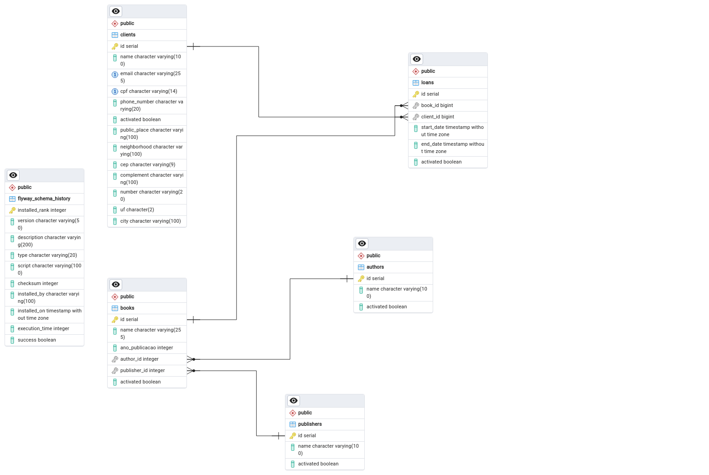

# Library API README

## Overview
The Library API manages authors, books, clients, publishers, and loans within a library system. It provides endpoints for registering, updating, listing, and disabling these entities.

## Image of the database generated in PgAdmin 4

## Technologies Used
- Java
- Spring Boot
- PostgreSQL
- Spring Security
- Swagger for API documentation

## Security
Spring Security has been implemented for token-based authentication, ensuring that only authorized users can access the endpoints. The API requires a bearer token for authentication.

Sensitive information such as database credentials and tokens are managed using environment variables to enhance security.

## Endpoints

### Author Controller (`/authors`)
- `POST /authors`: Register a new author.
- `GET /authors`: Get a paginated list of authors.
- `GET /authors/{id}`: Get details of a specific author.
- `PUT /authors`: Update author information.
- `DELETE /authors/{id}`: Disable an author.

### Book Controller (`/books`)
- `POST /books`: Register a new book.
- `GET /books`: Get a paginated list of books.
- `GET /books/{id}`: Get details of a specific book.
- `PUT /books`: Update book information.
- `DELETE /books/{id}`: Disable a book.

### Client Controller (`/clients`)
- `POST /clients`: Register a new client.
- `GET /clients`: Get a paginated list of clients.
- `GET /clients/{id}`: Get details of a specific client.
- `PUT /clients`: Update client information.
- `DELETE /clients/{id}`: Disable a client.

### Publisher Controller (`/publishers`)
- `POST /publishers`: Register a new publisher.
- `GET /publishers`: Get a paginated list of publishers.
- `GET /publishers/{id}`: Get details of a specific publisher.
- `PUT /publishers`: Update publisher information.
- `DELETE /publishers/{id}`: Disable a publisher.

### Loan Controller (`/loans`)
- `POST /loans`: Register a new loan.
- `GET /loans`: Get a paginated list of loans.
- `GET /loans/{id}`: Get details of a specific loan.
- `PUT /loans`: Update loan information.
- `DELETE /loans/{id}`: Finish a loan.

## Logging
Logging is implemented using SLF4J, providing insights into the execution flow of the application. Logs include information such as registering new entities, fetching details, updating information, and disabling entities.

## Data Validation
Data validation is performed using Jakarta Bean Validation (`@Valid`). This ensures that only valid data is accepted by the API, enhancing data integrity and security.

## Deployment
Ensure that environment variables containing sensitive information are properly configured before deploying the application. The application is designed to run with PostgreSQL as the database backend.

## Documentation
API documentation is generated using Swagger. Accessing the API endpoints via a web browser after running the application will provide detailed information about each endpoint, including request and response schemas.

## Contribution
Contributions to the API are welcome. Please follow the existing code style and conventions. Before submitting a pull request, ensure that all tests pass and new features are adequately documented.

